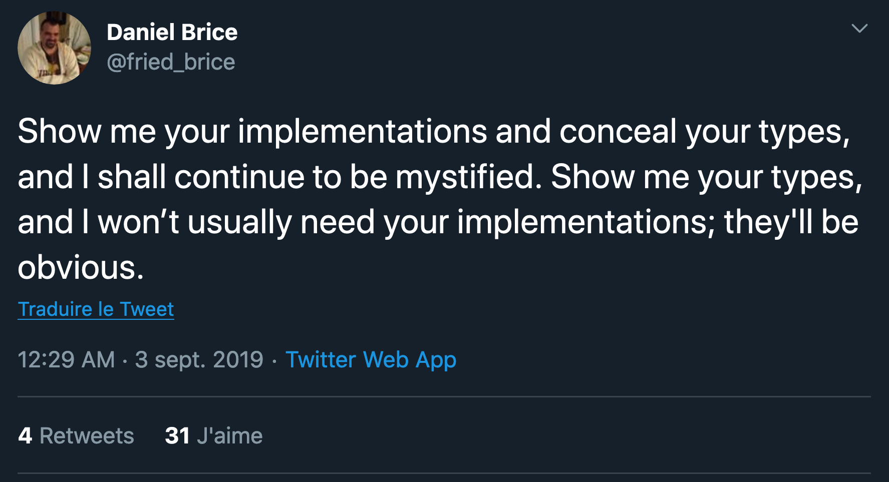

autoscale: true
build-lists: true


# [fit] Functional programming in Scala
# [fit] A practical introduction
## [fit] Guillaume Bogard - guillaumebogard.dev

---

# Goals

At the end of this training session, you will:

- Be able to write complete Scala programs on your own
- Have a solid understanding of some of the most important concepts surrounding functional programming
- Be able to handle asynchronous communication on TCP sockets

---

# What we will build

- A command-line Tic Tac Toe game that can be played both locally and on the local network
- We'll follow a *purely functional* style (no mutable state, strict encapsulation of side-effects)
- The game logic will be properly tested
- We'll use common Scala libraries

---

# What is Scala?

- Scala was born in 2003 at the EPFL
- It's a programming language that mixes ideas from strongly typed functional programming langauges such as Haskell and object-oriented languages such as Java
- It runs mostly on the JVM but also in the browser through Scala.js and natively through Scala Native
- On the JVM, it is completely interoperable with Java and its massive ecosystem

---

# Scala in the wild

- Scala is a general purpose language. Its main use cases are 
  - Web development
  - Data engineering
  - Highly concurrent applications more generally
- It is the most widely used functional programming language today
- It is used in production by Twitter, Zalando, Netflix, Disney, Fortnite, Linkedin ...

---

# Installing your development environment

To productive in Scala you'll need two things :

- `sbt`, which you can install through Homebrew or Sdkman
  - `sdk install sbt`
- A Scala IDE : Either Intellij IDEA or a text editor with the *Metals* extension
  - To use *Metals* you'll also need a JDK 8 installed

---

# Meet sbt

Sbt is the *de facto* build tool for Scala.

- It defines the metadata of your Scala project
- It fetches your external dependencies
- It leverages the Scala compiler to build your sources into .class files
- It runs your tests
- It allows you to define custom tasks and run them

---


## [fit] It's time to open your first Scala project
### [fit] Checkout the `exercises` branch and open the project

---

[.footer: HelloScala.scala]

# Hello, World!

- In Scala, the simplest Hello World is written as follows:

```scala
object Main extends App {
  println(“Hello world”)
}
```

- To run the project, we do

```
sbt run
```

---


# Functions and expressions

### Functions.scala

---

# Expressions

- An expression is a combination of terms that can be reduced to a value, e.g.:
  - `45 + 3`
  - `"Foo Bar Baz"`
  - `"Hello" + " " + "World"`

- Named values are defined using the `val` keyword
  - `val a = 12`
- Named values are immutable
- Every value has a type

---

# Typing

- All values have a type, including functions
- Types in Scala are organized into a hierarchy
  - Children of `AnyVal` : primitive value types such as `Boolean`, `Unit`, `String`, `Int`...
  - Children of `AnyRef` : object types such as `List`, `Option` and user-defined classes
  - `Any` is the root of all types

---

# Type inference

- The type of a value can in many cases be inferred ("guessed") by the compiler, meaning:
  - You can define it explicitly:
  `val name: String = "George"`
  - Or let the compiler do its work:
  `val name = "George"

---

# Complex expressions

- Scala is an expressive language : it doesn't make a distinction between expressions and statements that imperative languages make
- In other words : every construct in Scala yields a value, including control structure such as if/else
- Curly braces are use to delimitate complex expressions
- The effective value of a complex expression is the last line of the block

---

# Functions

- Methods in Scala are defined with the `def` keyword like so:
`def square(value: Int) = value * value`
- The return type of a method can be defined explicitly:
`def square(value: Int): Int = value * value`

*Methods* and *functions* are slightly different things in Scala, but for now we'll use them interchangeably.

---

# Different evaluation strategies

*Evaluation* is the process by which *expressions* are reduced to *values*

Scala supports different evaluation strategies for named values, methods, and methods arguments.

---

# `val` vs `def`

- `val`s are evaluated the moment they are defined
- `def`s are evaluated every time they are accessed
- `lazy val`s are evaluated when they are first accessed and then memoized for later use

---

# `val` vs `def`, an example

- This would crash immediately:

```scala
val a: String = throw new Exception(“BOOM”)
println(“Hello”)
println(a)
```

- This would print "Hello" then crash:

```scala
def a: String = throw new Exception(“BOOM”)
println(“Hello”)
println(a)
```

---

# Call-by-name, call-by-value

- By default, method arguments are evaluated before the body of the function. We call it *call-by-value*
- *Call-by-name* arguments are evaluated only when accessed within the body of the function, not before
  - It means we can partially evaluate the body of a function without evaluating its arguments
  - They are defined with a fat arrow like so
  `def greet(name: => String) = println("Hello " + name)`

---


# What is the billion dollar mistake? 💰

---

> I call it my billion-dollar mistake. It was the invention of the null reference in 1965. [...] This has led to innumerable errors, vulnerabilities, and system crashes, which have probably caused a billion dollars of pain and damage in the last forty years.
-- Sir Tony Hoare

---

[.footer: Options.scala]

# Options

- Options are designed to avoid the infamous `NullPointerException`
- Options can be one of two things : `Some` or `None`
- They make the code more explicit, remove the need to search in documentation for possible nulls and prevents runtime exceptions in many cases
- They are explicitly checked by the compiler

---

# Building options

- To build an empty option, use the `None` constructor:

```scala
val batmanFather: Option[String] = None 
```

- To build an option from a value, use the `Some` constructor:

```scala
val batgirlFather: Option[String] = Some("Jim Gordon")
```

---

# Working with options

- `map`
  - If you have `Option[A]` and `A => B`, then you get `Option[B]`
- `flatMap`
  - If you have `Option[A]` and `A => Option[B]`, then you get `Option[B]`
- `flatten`
  - If you have `Option[Option[A]]`, then you get `Option[A]`
- `getOrElse`
- `isEmpty`

---

# Case classes

Case classes are used to create immutable values out of multiple named fields. Think of them as immutable structs.

```scala
case class Position(x: Int, y: Int)
```

One the case class is defined, instances can be created like so :

```scala
val playerPosition = Position(18, 4)
```

---

- Case classes fields are public:

```scala
println(playerPosition.x)
```

- Case classes can be copied

```scala
val nextPosition = 
  playerPosition.copy(y = playerPosition.y + 1)
```

- They can be structurally compared

```scala
playerPosition == Position(18, 4) // => true
```

---


# What is functional programming?

---

### Functional programming is a *programming paradigm* that treats computation as the *evaluation* of *pure functions*.

##### (Or, as we call them, functions)

---

# What are functions?

- In procedural programming, the term *function* is often wrongfully used to mean *procedure*, a way of binding a set of instructions to name and some arguments

- In FP, we treat functions as mere arrows between values of two sets

- Functions are first-class citizens: they can be passed around as arguments, returned from other functions and composed

---


---

# A bit of history : Lambda-calculus

Lambda-calculus is the foundation of all functional languages. It can be described as the  *most simple, universal programming language*

Lambda-calculus doest not care about the computer. It abstracts away the computation steps under a purely expressive form, much like FP languages

Everything that can be computed by a Turing machine can be expressed in Lambda-calculus form[^1].

[^1]: Look at the Church-Turing thesis

--- 

# The syntax of λ-calculus

$$
\begin{align*}
	expression:= \
		&|\ variable && \text{ (identifier)} \\
	   	&|\ expression\ expression && \text{ (application)} \\
		&|\ \lambda variable . expression && \text{ (abtraction)} \\
		&|\ (expression) && \text{ (grouping)}
\end{align*}
$$

<br/>

λ-calculus is tiny symbol manipulation framework. 
It is entirely *expression-oriented*.

---

# How does it work?

Consider this function:

$$
f(x) = x^2
$$

We can implement it in Scala like so:

```scala
def f(x: Int) = x * x
```

And expressed in λ-calculus a:

$$
\lambda x.x^2
$$

---

Abstractions in λ-calculus don’t need to be named. 

Lambda calculus introduced anonymous functions as values for the first time. I

In some programming languages, anonymous functions are still called lambda expressions today.

Abstractions in λ-calculus are mappings from one expression to another. They are *unary* (only one argument)

---

## How would one write functions of two arguments in λ-calculus?

---

$$
f(x, y) = xy
$$

would become

$$
\lambda x .\lambda y.xy
$$

A function of two arguments *x* and *y* can be expressed as a function of a single argument *x*, itself returning a function of a single argument *y*. This is called *currying*.

Most importantly, λ-calculus introduced *higher-order functions* : functions that can take return other functions or take them as argument. `map`, `filter`, `reduce` ... you already know some of them!

---

# Some definitions 

- α-conversion : λx.x = λy.y (any variable can be renamed given it isn’t free)
- Β-reduction : lambda-terms may be reduced to a simpler form through a succession of conversions, until we reach a form we cannot further simplify (β-normal form)
 - This is the foundation of program *evaluation*

⚠ Some terms cannot be reduced (halting problem)

---


# Why do we care about Lambda-Calculus?
## A story of abstractions

---

Turing machines are hypothetical devices that perform state-based computation on an infinite strip. Turing machines work *imperatively*.

On the other hand, Lambda-calculus is a purely abstract symbol rewriting framework. It's *expressive*.

<br/>

Modern computers are built on the foundation of Turing machines. 

**One can usually categorize a programming language based on the level of abstraction it provides over the computer**

---

- Modern computers (Turing-machine-inspired)
- Machine code
- Assembly languages
- Higher-level machine-centric languages (C),
- Higher-level imperative and object-oriented languages (C#, Java ...)
- Functional languages (LISP, Ocaml ...)
- Purely functional languages (Haskell, Idris ...)

---

# Thinking beyond the machine


- Computers work imperatively. They execute instructions that change their state over time
- Functional programming languages operate on a higher level of abstraction : They don't care about the computer, they care very little for state, let alone time ... and it's great!
- Modern computers are more than capable of supporting these abstractions. Functional languages open up more possibilities for software engineering and developer productivity

--- 

### Programming concepts that come from Lambda-calculus

- Lazy evaluation
- Lexical scoping and shadowing
- **Referential transparency**
- **Recursion**
- **Higher-order functions**
- Currying
- Closures
...

---

# [fit] Defining pure functions
## [fit] How to identify *pure functions* in an impure language such as Scala?

---

## Referential transparency

- Referential transparency is one of the two key properties of pure functions
- A functions is *referentially transparent* if you can substitute its *application* for its return value without changing the program's behavior

---

## Example 

```scala
def square(a: Int) = a * a
val result = square(6)
```

And

```scala
val result = 36
```

are equivalent programs, which means that `square` is referentially transparent

We can also say it has no *side effects*.

---

## Example

```scala
def square(a: Int) = {
  println(“Hi!”)
  a * a
}
val result = square(6)
```

is not equivalent to

```scala
val result = 36
```

While the value of `result` is the same in both cases, the runtime behaviors of the two programs is not the same.

---

## Why should I care? Benefits of referential transparency

- Referentially transparent functions are trivial to test
- They are easy to execute in parallel
- Predictability! You know exactly how your program will run
- Memoization : if a function is guaranteed to return always the same result for some input, it can be memoized (cached) without risks
 
---

## Totality

- Totality is the other key characteristic of pure functions
- A function `A => B` must absolutely yield a value of `B` for *any* value `A`
- Partial functions (functions that operate on subsets of `A` or `B`) are unsafe
- As a rule of thumb, *if it compiles, it must always work*
  - Exceptions break totality and should be avoided im most cases

---


---

### A short definition for pure functions

## A function is pure if, and only if, it is both total and referentially transparent

---

## Spotting impure functions in the wild

---

### Is this function pure?

```scala
def max(a: Int, b: Int) =
	if (b >= a) b
  else a
```

Remember to ask yourself:

- Does it have side effects?
- Does it return a value for every possible argument?
- Is the return value defined by the arguments only?

---

### What about this one?

```scala
var counter = 0
def getName: String = {
	counter += 1
	”Jessica”
}
```

---

### And this one?

```scala
def mean(numbers: List[Int]): Float = {
  println(“Computing mean”)
  numbers.sum.toFloat / numbers.length
}
```

---

### This one is trickier

```scala
def mean(numbers: List[Int]): Float = {
  numbers.sum.toFloat / numbers.length
}
```

- Sometimes, identifying an impure function isn't as straightforward.
- How could we make it safer?

---

### What bout his last one?

```scala
def getSecret(user: User): Secret =
  if (user.isAdmin()) {
		secret
	} 
  else {
	  throw new Exception(“You don’t have access”)
  }
```

---

### From now one, we will only use pure functions

---

## Wait, how am I supposed to *do* stuff if everything is forbidden?

---

## Functional programmers have strategies

- Persistent Data Structures
- Algebraic Data Types
- Pattern matching
- IO monads

---


# Scala collections
#### Collections.scala

---

- Scala provides several collections that can model lists of elements, ranges, sets of unique elements, maps ...
- Scala's collections are persistent by default, which means you can't modify them in place
- Scala's collections are organized into a hierarchy. Different concrete data structures can be manipulated through common interfaces

---


---

### Which do I need?

- Is your code's performance critical?
  - Yes: check performance characteristics of all data structures in the documentation
  - No:
    - If you need a list of possibly duplicated elements, use `List`
    - If you need a list of unique elements, use `Set`
    - If you need to identify elements using a key, use a `Map`
  - If you're writing a library, it's a good idea to abstract over the collection type using an interface

---

## Working with Lists

- `map`: If you have `List[A]` and `A => B`, you get `List[B]`
- `flatMap`: If you have `List[A]` and `A => List[B]`, you get `List[B]`
- `filter`: If you have `List[A]` and `A => Boolean`, you get a subset of your original list
- `flatten`: If you have `List[List[A]]`, then you get `List[A]`
- `headOption` : A safe way of retrieving the first element
- `lift` : A safe way of retrieving any element
- `sum` (on a numerical list only)

---

### Structural sharing


---

# A couple things to remember

- Lists are good at prepending (constant time) but no so much at appending (linear time)
- Persistent data structures are space efficient : since every value is reputed immutable, they can be shared by reference across multiple structures

---


## [fit] Building new types
### [fit] Domain modeling using Algebraic Data Types

#### ADT.scala

---

# Product Types

Tuples and case classes can encapsulate the values of several types into one single value :

```scala
val cathy: (String, Int, Role) = 
  ("Cathy", 38, Role.Manager)
```

---

# The cartesian product

Product types are called that way because they can be seen as the cartesian product of several sets :

- Types, such as `Int` and `Boolean` are sets
- A tuple `(Int, Boolean)` can match any `Int` with any `Boolean`
- The total number of distinct values this tuple can have will be
  - The number of values `Int` can take
  - Multiplied by the number of values `Boolean` can take (2)

---


---

## Case classes are product types

Case classes can be seen as tuples with labels

```scala
case class User(
  firstName: String,
  lastName: String
)
```

can be expressed as 

```scala
type User = (String, String)
```

However, tuples are ambiguous. Which is the `firstName` in that case ?
Keep tuples for very simple values and internal use only.

---

# Sum types

- Sum types can hold values coming from exactly one of several fixed types
- They are sometimes called *variants*, *disjoint unions* or *discriminated unions*
- They can be recursive

---

## Common subtypes you might already know

- `Option[A]`: One of `Some[A]` or `None`
- `Either[L, R]`: One of `Left[L]` or `Right[R]`
- `List[A]` : One of `Nil` or `::(A, List[A])`

---

## Lists are recursive sum types!

The `List` structure, a linked list, is sum type of two *terms* :

```scala
sealed trait List[+A]
// A Nil term representing an empty list
case object Nil extends List[Nothing]

// A :: term representing an element 
//and a pointer to the rest of the list
case class ::[A](head: A, tail: List[A]) extends List[A]
```

---

This is how we would build lists using that encoding:

```scala
Nil                          // An empty List
::(1, Nil)                   // A List of one element
::(1, ::(2, Nil))            // A list of two elements
::(1, ::(2, ::(3, Nil)))     // And so on ...
```

<br />

Luckily, Scala provides some syntactic sugar for us:

```scala
val nb = 1 :: 2 :: 3 :: 4 :: Nil
```

---

### Algebraic Data Types are the main tool for data modeling in Scala

---

# A sum type for our Tic Tac Toe

We can model a *move* in the Tic Tac Toe game using a sum type

```scala
sealed trait Move
case object X extends Move
case object O extends Move
```

NB: Case objects are singleton objects. You can see them as sets of exactly one element

---


# Pattern matching

### PatternMatching.scala

---

## Pattern matching

- Pattern matching is a pure mapping between a *pattern of expressions* on the left side, and an expression on the right side.
- It can deconstruct case classes and match their individual fields
- It can have arbitrary guards (if statements)
- Exhaustivity can be enforced at compile tile

---

## How does that help us?

- Persistent data structures give us
  - Complex data transformations without the need for shared mutable state and its risk
- ADTs coupled with pattern matching give us
  - Powerful data modeling
  - Total functions
  - Safety from the most common runtime exceptions

---


## General strategies for building total functions

In order to make a function total, you generally have two possible approaches:

- Restrict the input of the function (or *domain*) so that your function can't be called with input you can't deal with
- Expand the output of the function (or *codomain*) so that you can produce a result in every case

---

^ If possible make schema on board

## Expanding the output

Expanding the output generally means turning your return type from `A` to `Option[A]`, `Either[Error, A]` or another structure.

Instead of returning values from the smaller set `A`, you operate on a bigger set, the set of *A + all the possible edge-cases*.

You essentially force your caller to deal with the edge cases somewhere outside.

---

## Restricting the input

You can alsso change the types of your arguments to accept a smaller set of values. This way, you ensure your function cannot be called with values you can't handle.

For instance, instead of accepting any `String`, you can use a sum type as your input type.

---

## Summing up

Scala let's you perform the most common computing tasks without relying on side-effects.

Writing total functions means you don't need Exceptions to deal with edge-cases, hence no crashes at runtime.

Writing referentially transparent functions means you can refactor your code safely. It also means *no lies* : your types should always tell the truth

---


---

## But still,
## what if I *need* that side-effect?

---

## Introducing IO monads

#### SideEffects.scala

---

## IO monads

- The `IO` monad comes from Haskell, a purely functional language where side effects are strictly forbidden
- An `IO[A]` represents a *lazy* computation that has some side effects and eventually yields a value of type `A`
- IOs can be transformed with `map` and composed with `flatMap` just like `Option` and `List`

---

## Why do we care?

- The #1 reason: **functions signatures are contract*. When you perform a side-effect without signaling it, you break the contract. (aka. *Friends don't lie*)
- `IO`s reduce the need for further documentation and the risk of forgetting to catch an exception
- They are referentially transparent, so you can define them in any order
- In a FP team, other functions should be assumed to be pure

---



---

## Other benefits from `IO`

- They can raise and recover exceptions
- They can easily be executed in parallel
- They form a large ecosystem that makes concurrent applications easier
  - Concurrency constructs from Cats Effect such as `Ref`, `MVar`...
  - Reactive streams with fs2
  - Purely functional database access with Doobie
  - Highly performant HTTP APIs with Http4s
  ...

---


### [fit] Your first, purely functional, Scala application
## [fit] Building a functional Tic Tac Toe

---

Let's use what we've learn to build a command-line game that can be played on the network!

- Tic Tac Toe can be modeled as a *finite state machine*
- Possible states = a `State` ADT
- State transitions = pure function of `State => State`
- The board will be a matrix of *moves*, modeled as a two-dimensional `List`
- The user interface and server can be separated from the core logic using higher-order functions and IO monads